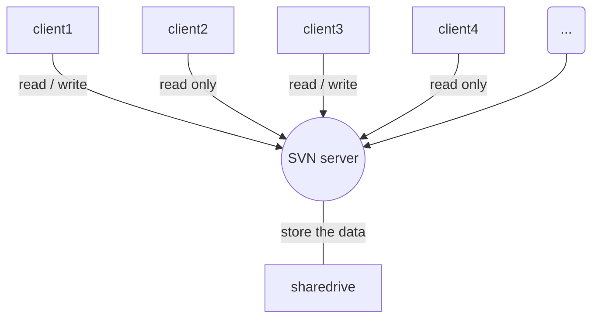

[TOC]
# Markdown是什么
Markdwon 是一种轻量级 标记语言，它以纯文本形式（易读、易写、易更改）编写文档，并最终以HTLM格式发布。Markdown也可以理解为将以 MARKDOWN语法编写的语言转换成HTML内容的工具。

# 为什么要使用Markdown
- 它是易读（看起来舒服😌）、易写（语法简单）、易更改（纯文本）。处处体现着极简主义的影子
- 兼容HTML,可以转换为HTML格式发布
- 跨平台使用
- 越来越多的网站支持Markdown
- 更方便清晰的组织你的电子邮件
- 摆脱Word,txt！！！

# 快捷键

加粗 Ctrl + B
斜体 Ctrl + I
引用 Ctrl + Q
插入链接 Ctrl + L
插入代码 Ctrl + K
插入图片 Ctrl + G
提升标题 Ctrl + H
有序列表 Ctrl + O
无序列表 Ctrl + U
横线 Ctrl + R
撤销 Ctrl + Z
重做 Ctrl + Y

<escape><!-- more --></escape>

# 基本语法

## 对字体设置斜体、粗体、删除线

这里是文字
*这里是文字*
_这里是文字_
**这里是文字**
***这里是文字***
~~这里是文字~~


## 分级标题

有如下两种写法:
写法1:

    # 一级标题
    ## 二级标题
    ### 三级标题
    #### 四级标题
    ##### 五级标题
    ###### 六级标题


写法2:

    一级标题
    ==
    二级标题
    --


## 链接
### 插入本地图片链接
语法规范,有两种写法:
```

```
	图片alt就是显示在图片下面的文字，相当于对图片内容的解释。
	图片title是图片的标题，当鼠标移到图片上时显示的内容
	alt和title可加可不加

注：Markdown 不能设置图片大小，如果必须设置则应使用HTML标记 ``````
``

`插入同级目录下的图片:  `

 

`插入下一级目录下的图片: `


### 插入网络图片
语法规范:
``
	注意:图片描述可以不写

`示例: `


### 自动连接
Markdown中只要是用`<>`包起来的就会自动把它转成链接。也可以直接写，也是可以显示成链接形式的

https://blog.ejubei.net
<https://blog.ejubei.net>


### 超链接
    语法:
    [超链接名](超链接地址 "超链接title")
    title可加可不加
示例:
[简书](http://jianshu.com)
[百度](http://baidu.com)

## 分割线
在一行中用三个以上的星号(*)、减号(-)、底线(_)来建立一个分隔线，行内不能有其他东西,
也可以在星号或是减号中间插入空格.

    ****
    ----
    ____


## 段落
段落的前后要有空行，所谓的空行是指没有文字内容。若想在段内强制换行的方式是使用两个以上空格加上回车（引用中换行省略回车）

## 代码块

插入程序代码的方式有两种，一种是利用缩进(tab), 另一种是利用英文“\`”符号（一般在ESC键下方，和~同一个键）包裹代码。

### 缩进
缩进 4 个空格或是 1 个制表符

    inputPath = sys.argv[1]
    for input_file in glob.glob(os.path.join(inputPath,'*.txt')):
        with open(input_file, 'r', newline='') as filereader:
            for row in filereader:
                print("{}".format(row.strip()))


### 行内式
如果在一个行内需要引用代码，只要用反引号“\`”引起来就好

### 多行代码块与语法高亮
在需要高亮的代码块的前一行及后一行使用三个单反引号“\`”包裹

代码语法高亮在 ```后面加上空格和语言名称即可

```python
inputPath = sys.argv[1]
for input_file in glob.glob(os.path.join(inputPath,'*.txt')):
    with open(input_file, 'r', newline='') as filereader:
    for row in filereader:
        print("{}".format(row.strip()))
```


#### 代码块里面包含html代码
在代码区块里面， & 、 < 和 > 会自动转成 HTML 实体，只需要复制贴上，剩下的 Markdown 都会帮你处理。
```html
<h4>带有普通的边框：</h4>
<table border="1">
    <tr>
      <td>First</td>
      <td>Row</td>
    </tr>
    <tr>
      <td>Second</td>
      <td>Row</td>
    </tr>
</table>
```


## 引用
在被引用的文本前加上>符号，以及一个空格就可以了，如果只输入了一个>符号会产生一个空白的引用.

### 基本使用

> 这是一个引用
> 这是另一个引用
> 
> 这是第三个引用


### 嵌套引用

> 引用1
> > 引用2
> >
> > > 引用3


> > > 引用3
> >
> > 引用2
>
> 引用1


### 引用其它要素
引用的区块内也可以使用其他的 Markdown 语法，包括标题、列表、代码区块等

## 列表
### 无序列表
使用 *，+，- 表示无序列表,符号后面一定要有一个空格，起到缩进的作用

- 无序列表1
- 无序列表2

* 无序列表1
* 无序列表2

+ 无序列表1
+ 无序列表2


### 有序列表
使用数字和一个英文句点表示有序列表,英文句点后面一定要有一个空格，起到缩进的作用

1.正常显示(点后面没有加空格)

1. 有序列表1
2. 有序列表2


### 无序列表和有序列表同时使用

### 列表和其它要素混合使用
列表不光可以单独使用，也可以使用其他的 Markdown 语法，包括标题、引用、代码区块等.
注意事项：
(1) 加粗效果不能直接用于列表标题里面，但是可以嵌套在列表里面混合使用。
(2) 列表中包含代码块（前面加2个tab或者8个空格，并且需要空一行，否则不显示）。

### 注意事项
在使用列表时，只要是数字后面加上英文的点，就会无意间产生列表，比如2017.12.30 这时候想表达的是日期，有些软件把它被误认为是列表。解决方式：在每个点前面加上\就可以了。

## 表格
语法规则:
    -默认左对齐
    :-左对齐
    -:右对齐
    :-:居中对齐
    其中，-表示列表宽度的权重，比如--是-宽度的两倍
示例:
    |表头|表头|表头|
    |---|----|---|
    |内容|内容|内容|
    |内容|内容|内容|
其中,
第二行分割表头和内容。
- 有一个就行，为了对齐，多加了几个
文字默认居左
```
姓名|年龄|班级
-|-|-|
小明|12|一年级
```
姓名|年龄|班级
-|-|-|
小明|12|一年级


表格对齐方式：居中对齐
```
姓名|年龄|班级
:-:|:-:|:-:|
小明|12|一年级
```
姓名|年龄|班级
:-:|:-:|:-:|
小明|12|一年级

小技巧:
网站Tables Generator: <http://www.tablesgenerator.com/>,
在线制作表格并生成该表格相应的LaTex代码、HTML代码、Markdown代码、Text代码，只需复制这些代码到本Markdown编辑器里便可以生成相应的表格

## 字体上、下标语法
```
这是^上标文字^
这是~下标文字~
```
这是^上标文字^
这是~下标文字~

## 注释

注释是给自己看的，预览时也不会出现，当然发布出去别人也不会看见。

```
<!--注释-->
```

# 常用技巧

## 换行
方法1: 连续两个以上空格+回车
方法2：使用html语言换行标签：`<br>`

## 缩进字符
不断行的空白格 &nbsp; 或 &#160;
半角的空格 &ensp; 或 &#8194;
全角的空格 &emsp; 或 &#8195;


## 打出特殊符号
1. 对于 Markdown 中的语法符号，前面加反斜线\即可显示符号本身


2. 其他特殊字符


字符对应的Unicode码，可以看这个网站：https://unicode-table.com/cn/

## 字体/字号/颜色
Markdown本身是不支持修改字体、字号与颜色等功能的,不过可以使用内嵌HTML的方法来实现
示例代码如下:

```
<font face="微软雅黑" color="red" size="6">字体及字体颜色和大小</font>
<font color="#0000ff">字体颜色</font>
```
实际效果:
<font face="微软雅黑" color="red" size="6">字体及字体颜色和大小</font>
<font color="#0000ff">字体颜色</font>

size: 规定文本的尺寸大小.范围是1-7,浏览器默认值是3.
RGB颜色查询对照表: <https://www.114la.com/other/rgb.htm>

## 文本对齐方式
```
<p align="left">居左文本</p>
<p align="center">居中文本</p>
<p align="right">居右文本</p>
```
<p align="left">居左文本</p>
<p align="center">居中文本</p>
<p align="right">居右文本</p>

## 下划线
```
<u>下划线文本</u>
```
<u>下划线文本</u>

## 链接的高级操作
### 行内式
这是行内式:`啊哈`

### 内容目录
在段落中填写 [TOC] 以显示全文内容的目录结构.

### 锚点 
锚点其实就是页内超链接。比如这里写下一个锚点，点击回到目录，就能跳转到目录。 在目录中点击这一节，就能跳过来。

语法说明：
在你准备跳转到的指定标题后插入锚点，然后在文档的其它地方写上连接到锚点的链接。


### 注脚
脚注为先定义，后使用:
定义格式：`[^定义名]: 定义内容`
使用格式：`直接在需要定义的文本内容后面加上[ ^定义名]`
例如：
```
生成一个脚注[^footnote]。
[^footnote]: 这里是脚注的内容。（注意：[^footnote]后的双引号是在英文输入下输入的）
```

注：
(1) 脚注自动被搬运到最后面，请到文章末尾查看，并且脚注后方的链接可以直接跳转回到加注的地方。
(2) 不支持锚点的软件，可以用注脚实现页面内部的跳转。
(3) 点击脚注可直接到达底部脚注注释处

## 背景色
Markdown本身不支持背景色设置，需要采用内置html的方式实现：借助 table, tr, td 等表格标签的
bgcolor 属性来实现背景色的功能。举例如下：
```html
<table><tr><td bgcolor=green>背景色是：green</td></tr></table>
```
<table><tr><td bgcolor=green>背景色是：green</td></tr></table>

## emoji表情符号
emoji表情使用:EMOJICODE:的格式
详细列表可见: <https://www.webpagefx.com/tools/emoji-cheat-sheet/>
```
:sunglasses:
:musical_note:
:gift_heart:
```
:sunglasses:
:musical_note:
:gift_heart:

## 转义


# 高端用法
## 使用LaTex数学公式
LaTeX[^LaTeX说明]的数学公式有两种：行内公式和块级公式
行内公式放在文中与其他文字混编，块级公式单独成行,都使用美元符号进行标记显示。

简单规则：
1、LaTex公式由$符号开始，由$结束；
2、空格：LaTeX中空格用来隔开单词(英语一类字母文字)，多个空格等效于一个空格；对中文没有作用。
3、换行：用控制命令“\”,或“ \newline”.。
4、分段：用控制命令“\par” 或空出一行。
5、换页：用控制命令“\newpage”或“\clearpage” 。
6、特殊控制字符：#，$, %, &, - ,{, }, ^, ~ 要想输出这些控制符用下列命令：
`\# \$ \% \& \- \{ \} \^{} \~{}`
`​$\backslash​$表示'\' `

1. 行内公式
标记方法：使用一对美元符号包围起来，$行内公式$，例如：
```
这是一个行内公式（$\sqrt{x^2{2}}$）
```
这是一个行内公式（$\sqrt{x^{2}}​$）

2. 块级公式
使用两对“$$”符号引用公式：​$$公式$$
```
这是一个块级公式($$\frac{1+x}{2^x}$$)
```
这是一个块级公式($$\frac{1+x}{2^x}$$)

3. 上标和下标
    ^表示上标, _表示下标. 如果上下标的内容多于一个字符，要用{}把这些内容括起来当成一个总体。上下标是能够嵌套的，也能够同一时候使用。（注：在实际实现公式时，下列“效果”一栏应用$符号包围起来）。

| 上/下标 | 语法              | 效果              |
| ------- | ----------------- | ----------------- |
| 上标    | 10^{x+2}       | $10^{x+2}$           |
| 下标    | y=2x_1 + 3x_2    | $y=2x_1 + 3x_2$   |
| 嵌套    | y=2x_1^2 + 3x_2^4 | $y=2x_1^2 + 3x_2^4$ |

另外，假设要在左右两边都有上下标。能够用\sideset命令。如：`$\sideset{^1_2}{^3_4}\bigotimes$`效果:$\sideset{^1_2}{^3_4}\bigotimes$

4. 分数 
方法1：\frac{分子}{分母}（若分子分母都是单数，则大括号可以省略） 
方法2：分子 \over 分母

| 分数  | 语法                       | 效果 |
| ----- | -------------------------- | ---- |
| 方法1 | \frac{x+1}{3x}             | $\frac{x+1}{3x}$     |
| 方法2 | 2x_1 + 3x_2\over x_2 + x_3 | $2x_1 + 3x_2\over x_2 + x_3$     |

5. 各类括号
()、[]和|能够直接表示自己。而{}本来用于分组。因此须要用\{ \}来表示自身，也能够使用\lbrace 和\rbrace来表示。其他括号见以下表。
如：`\{[2x - (1 + \frac{7}{3x})] - 6y\}`
效果：${[2x−(1 + \frac{7}{3x})]−6y}​$

注意：原始符号并不会随着公式大小缩放。有时候我们想要括号和分隔符显示的大点。比方上面样例中希望括号能把整个分数都包住，那么能够用\left和\right标记，实现自适应调整。（放在需要适应的括号的前面）
如：`$\left\{[2x - (1 + \frac{7}{3x})] - 6y\right\}$`
效果：$\left\{[2x - (1 + \frac{7}{3x})] - 6y\right\}​$

\left和\right标记能应用的括号非常多：

| 括号名   | 语法                                        | 效果                    |
| -------- | ------------------------------------------- | ----------------------- |
| 小括号   | \left(x+2\right)                            | $\left(x+2\right)$                 |
| 中括号   | \left[2x + (5 + 6y)\right]                  | $\left[2x + (5 + 6y)\right]$ |
| 大括号   | \left{[2x - (1 + \frac{7}{3x})] - 6y\right} | $\lbrace[2x - (1 + \frac{7}{3x})] - 6y\rbrace$ |
| 尖括号   | \left\langle3 + 4x\right\rangle             | $\left\langle3 + 4x\right\rangle$               |
| 向上取整 | \left\lceil1 + 2x\right\rceil               | $\left\lceil1 + 2x\right\rceil $              |
| 向下取整 | \left\lfloor2 + 3x\right\rfloor             | $\left\lfloor2 + 3x\right\rfloor$               |

6. 根号
    根号开方使用\sqrt标记，语法格式例如以下： \sqrt[开方次数，默人为2]{开方因子}

| 根号  | 语法                           | 效果 |
| ----- | ------------------------------ | ---- |
| 示例1 | \sqrt[3]{1 + \frac{1+x}{2+3x}} | $\sqrt[3]{1 + \frac{1+x}{2+3x}}$     |
| 示例2 | \sqrt{8}                       |  $\sqrt{8}$    |

7. 省略号

数学公式中常见的省略号有两种。\ldots表示与文本底线对齐的省略号，\cdots表示与文本中线对齐的省略号。如：

| 省略号         | 语法                                                      | 效果 |
| -------------- | --------------------------------------------------------- | ---- |
| 与文本中线对齐 | f(x_1, x_2, \cdots, x_n) = x_1^2 + x_2^2 + \cdots + x_n^2 |  $f(x_1, x_2, \cdots, x_n) = x_1^2 + x_2^2 + \cdots + x_n^2$    |
| 与文本底线对齐 | x_1x_2x_3\ldots                                           | $ x_1x_2x_3\ldots$     |

注意：\ldot和\cdot能够表示与文本底线和中线对齐的单个点。

8. 数学矢量

矢量用\vec标记实现,语法格式：\vec{矢量值}，如下：

| 矢量  | 语法                           | 效果 |
| ----- | ------------------------------ | ---- |
| 示例1 | \vec{a}\cdot\vec{b} = \vec{ab} |  $\vec{a}\cdot\vec{b} = \vec{ab}$    |

9. 字符间隔

通常MathJax通过内部策略自己管理公式内部的空间，因此a︹︹b与a︹︹︹︹︹b（︹表示空格）都会显示为ab。 
因此，能够通过在ab间添加\空格或\;添加些许间隙，\quad 与 \qquad 会添加更大的间隙，如下：

| 间隔  | 语法      | 效果    |
| ----- | --------- | ------- |
| 示例1 | a\ b      | $a\ b$ |
| 示例2 | a\;b      | $a\;b$        |
| 示例3 | a\quad b  |  $a\quad b$       |
| 示例4 | a\qquad b |  $a\qquad b$       |

10. 希腊字母

| 序号  | LaTex代码   | 结果          | 中文名 |
| ----- | ---------   | -------       |------- |
|  1    | \alpha      | $\alpha$      |阿尔法  |
|  2    | \beta       | $\beta$       |贝塔    |
|  3    | \gamma      | $\gamma$      |伽马    |
|  4    | \delta      | $\delta$      |德尔塔  |
|  5    | \zeta       | $\zeta$       |泽塔    |
|  6    | \eta        | $\eta$        |伊塔    |
|  7    | \theta      | $\theta$      |西塔    |
|  8    | \iota       | $\iota$       |约塔    |
|  9    | \kappa      | $\kappa$      |卡帕    |
|  10   | \lambda     | $\lambda$     |兰姆达  |
|  11   | \mu         | $\mu$         |缪      |
|  12   | \nu         | $\nu$         |纽      |
|  13   | \xi         | $\xi$         |克西    |
|  14   | \omicron    | $\omicron$    |欧米克隆|
|  15   | \pi         | $\pi$         |派      |
|  16   | \rho        | $\rho$        |柔      |
|  17   | \sigma      | $\sigma$      |西格玛  |
|  18   | \tau        | $\tau $       |陶      |
|  19   | \upsilon    | $\upsilon$    |宇普西隆|
|  20   | \phi        | $\phi$        |弗爱    |
|  21   | \chi        | $\chi$        |卡      |
|  22   | \psi        | $\psi$        |普赛    |
|  23   | \omega      | $\omega$      |欧米伽  |
|  24   | \varepsilon | $\varepsilon$ |异体    |
|  25   | \varkappa   | $\varkappa$   |异体    |
|  26   | \vartheta   | $\vartheta$   |异体    |
|  27   | \varpi      | $\varpi$      |异体    |
|  28   | \varrao     | $\varrao$     |异体    |
|  29   | \varsigma   | $\varsigma$   |异体    |
|  30   | \varphi     | $\varphi$     |异体    |

11. 特殊字符

11.1 关系运算符

±:   \pm
×:   \times
÷:   \div
∣:   \mid
∤:   \nmid
⋅:   \cdot
∘:   \circ
∗:   \ast
⨀:   \bigodot
⨂:   \bigotimes
≤:   \leq
≥:   \geq
≠:   \neq
≈:   \approx
≡:   \equiv
∑:   \sum
∏:   \prod
∐:   \coprod

11.2 集合运算符
∅:   \emptyset
∈:   \in
∉:   \notin
⊂:   \subset
⊃:   \supset
⊆:   \subseteq
⊇:   \supseteq
⋂:   \bigcap
⋃:   \bigcup
⋁:   \bigvee
⨄:   \biguplus
⨆: \bigsqcup

11.3 对数运算符

log:  \log
ln:   \ln
lg: \lg

11.4 三角运算符

⊥:   \bot
∠:   \angle
30∘:   \30^circ
sin:   \sin
cos:   \cos
tan: \tan
cot: \cot
sec: \sec
csc:\csc

11.5 微积分运算符

′: \prime
∫: \int
∬: \iint
∭: \iiint
∬∬: \iiiint
∮: \oint
lim: \lim
∞: \infty
∇:\nabla

11.6 逻辑运算符

y^: \hat{y}

11.7 连线符号

$\overline{a+b+c+d}$: \overline{a+b+c+d}
$\underline{a+b+c+d}$ : \underline{a+b+c+d}
$\overbrace{a+\underbrace{b+c}_{1.0} + d}^{2.0}$: \overbrace{a+\underbrace{b+c}_{1.0} + d}^{2.0}

11.7 箭头符号

↑: \uparrow
↓: \downarrow
⇑: \Uparrow
⇓: \Downarrow
→: \rightarrow
←: \leftarrow
⇒: \Rightarrow
⇐: \Leftarrow
⟶: \longrightarrow
⟵: \longleftarrow
⟹: \Longrightarrow
⟸: \Longleftarrow

综合上面的符号语言，有如下几个综合的例子：
$ \sum_{i=0}^n\frac{1}{i^2} $: \sum_{i=0}^n\frac{1}{i^2}

$ \prod_{i=0}^n\frac{1}{i^2} ​$: \prod_{i=0}^n\frac{1}{i^2}

$ \int_0^1 x^2{\rm d}x $: \int_0^1 x^2{\rm d}x

$ \lim_{n\rightarrow + \infty}\frac{1}{n(n+1)} $

## 流程图
主要的语法为 name=>type: describe，其中 type 主要有以下几种：
1.开始和结束：start end
2.输入输出：inputoutput
3.操作：operation
4.条件：condition
5.子程序：subroutine

```
st=>start: Start|past:>http://www.google.com[blank]
e=>end: End:>http://www.google.com
op1=>operation: My Operation|past
op2=>operation: Stuff|current
sub1=>subroutine: My Subroutine|invalid
cond=>condition: Yes 
or No?|approved:>http://www.baidu.com
c2=>condition: Good idea|rejected
io=>inputoutput: catch something...|request

st->op1(right)->cond
cond(yes, right)->c2
cond(no)->sub1(left)->op1
c2(yes)->io->e
c2(no)->op2->e
```
```flow
st=>start: Start|past:>http://www.google.com[blank]
e=>end: End:>http://www.google.com
op1=>operation: My Operation|past
op2=>operation: Stuff|current
sub1=>subroutine: My Subroutine|invalid
cond=>condition: Yes 
or No?|approved:>http://www.baidu.com
c2=>condition: Good idea|rejected
io=>inputoutput: catch something...|request

st->op1(right)->cond
cond(yes, right)->c2
cond(no)->sub1(left)->op1
c2(yes)->io->e
c2(no)->op2->e
```
语法参考: <https://link.jianshu.com/?t=https://github.com/adrai/flowchart.js>

##  任务列表

```
- [] 未处理的事情
- [x] 已处理的事情
```
- [ ] 未处理的事情
- [x] 已处理的事情

注:点击方框,显示的是对号,但是源码里显示的是差号

## 绘制 序列图
```
Title:连接建立的过程
客户主机->服务器主机: 连接请求（SYN=1,seq=client_isn） 
服务器主机->客户主机: 授予连接（SYN=1,seq=client_isn）\n ack=client_isn+1
客户主机->服务器主机: 确认（SYN=0,seq=client_isn+1）\nack=server_isn+1
```
```sequence
Title:连接建立的过程
客户主机->服务器主机: 连接请求（SYN=1,seq=client_isn） 
服务器主机->客户主机: 授予连接（SYN=1,seq=client_isn）\n ack=client_isn+1
客户主机->服务器主机: 确认（SYN=0,seq=client_isn+1）\nack=server_isn+1
```
```
title: 序列图sequence(示例)
participant A
participant B
participant C
note left of A: A左侧说明
note over B: 覆盖B的说明
note right of C: C右侧说明
A->A:自己到自己
A->B:实线实箭头
A-->C:虚线实箭头
B->>C:实线虚箭头
B-->>A:虚线虚箭头
```
```sequence
title: 序列图sequence(示例)
participant A
participant B
participant C
note left of A: A左侧说明
note over B: 覆盖B的说明
note right of C: C右侧说明
A->A:自己到自己
A->B:实线实箭头
A-->C:虚线实箭头
B->>C:实线虚箭头
B-->>A:虚线虚箭头
```
```
主要有以下几种关键词:
    title, 定义该序列图的标题
    participant, 定义时序图中的对象
    note, 定义对时序图中的部分说明
    {actor}, 表示时序图中的具体对象（名称自定义）
其中针对note的方位控制主要包含以下几种关键词：
    left of, 表示当前对象的左侧
    right of, 表示当前对象的右侧
    over, 表示覆盖在当前对象（们）的上面
其中针对{actor}的箭头分为以下几种：
    -> 表示实线实箭头
    –> 表示虚线实箭头
    ->> 表示实线虚箭头
    –>> 表示虚线虚箭头
```
语法参考: <https://link.jianshu.com/?t=https://bramp.github.io/js-sequence-diagrams/>

## 绘制 甘特图
```
graph TD
client1-->|read / write|SVN((SVN server))
client2-->|read only|SVN
client3-->|read / write|SVN
client4-->|read only|SVN
client5(...)-->SVN
SVN---|store the data|sharedrive
```

语法参考: <https://link.jianshu.com/?t=http://knsv.github.io/mermaid>
## Markdow工具
1. Typora
2. MarkdownPad 2

[^LaTeX说明]: LaTeX（LATEX，音译“拉泰赫”）是一种基于ΤΕΧ的排版系统，由美国计算机学家莱斯利·兰伯特（Leslie Lamport）在20世纪80年代初期开发，利用这种格式，即使使用者没有排版和程序设计的知识也可以充分发挥由TeX所提供的强大功能，能在几天，甚至几小时内生成很多具有书籍质量的印刷品。对于生成复杂表格和数学公式，这一点表现得尤为突出。因此它非常适用于生成高印刷质量的科技和数学类文档。这个系统同样适用于生成从简单的信件到完整书籍的所有其他种类的文档。
